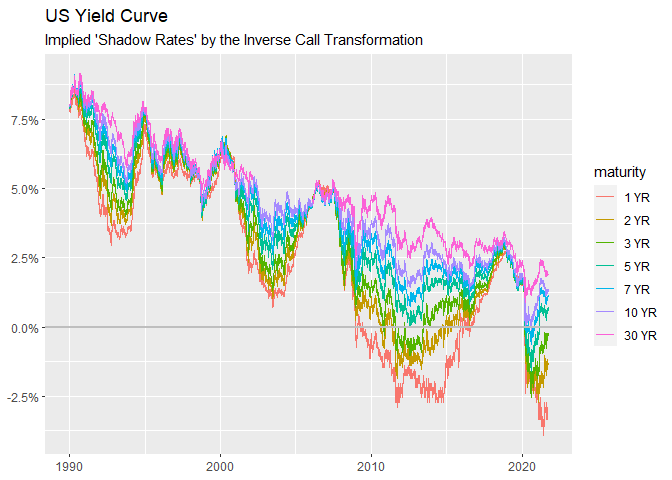

<!-- README.md is generated from README.Rmd. Please edit that file -->

# ShadowRates

> Removes the zero lower bound from interest-rates

<!-- badges: start -->
<!-- badges: end -->

## Installation

You can install the development version from github:

``` r
# install.packages("devtools")
devtools::install_github("Reckziegel/shadow")
```

## Toy Example

``` r
library(ShadowRates)
library(ggplot2)

data("us_yield_curve")

us_yield_curve |> 
  # shadow
  shadow_rates(.group_col = maturity, .dbl_col = rates, eta = 0.015) |> 
  # plotting
  ggplot(aes(x = index, y = rates, color = maturity)) + 
  geom_line() + 
  geom_hline(yintercept = 0, size = 1, color=  "grey") + 
  scale_y_continuous(labels = scales::percent_format(), breaks = scales::breaks_width(0.025)) + 
  labs(title    = "US Yield Curve", 
       subtitle = "Implied 'Shadow Rates' by the Inverse Call Transformation", 
       x        = NULL, 
       y        = NULL)
```


